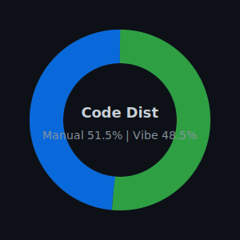

<h1 align="center">Hey, I'm Naumish 👋</h1>

  <em>AI/ML dev · LLM tinkerer · Building things that talk back 🤖🎙️</em>

---

### 🙋 About Me

- 🧠 CS undergrad @ **IIIT Raichur** (2023–2027), deep in AI/ML land
- 🤖 Currently building **Athena** — a voice-driven multi-agent desktop assistant (LangChain + RAG + Whisper + XTTS)
- 🧬 Love applying ML to real-world messy data — cancer genomics, medical imaging, you name it
- 💬 Ask me about LLMs, RAG pipelines, speech AI, or computer vision
- 📬 Reach me at **ntirth005@gmail.com**
- 🤝 Open to collabs on AI/ML projects & open-source research

---

### 🛠️ Tech Stack

**Languages**

  
  
  

**ML / AI**

  
  
  
  
  

**Tools & Platforms**

  
  
  
  
  

---

### 📊 GitHub Stats

### ⚖️ Coding Style Distribution

<!-- CODE_STYLE_DISTRIBUTION_START -->

  
  

| Repository | Manual Code | Vibe Code | Weight |
|---|---:|---:|---:|
| [visiontouch](https://github.com/ntirth005/visiontouch) | 50.0% | 50.0% | 126937.0 |
| [Medical-Image-Segmentation-Study](https://github.com/ntirth005/Medical-Image-Segmentation-Study) | 100.0% | 0.0% | 2645.0 |
| [expense-tracker](https://github.com/ntirth005/expense-tracker) | 80.0% | 20.0% | 1285.0 |
| [Embryo-Stage-Classification](https://github.com/ntirth005/Embryo-Stage-Classification) | 100.0% | 0.0% | 337.0 |
| [SecureDroneCommunication](https://github.com/ntirth005/SecureDroneCommunication) | 40.0% | 60.0% | 104.0 |
| [cnn-lstm-Embryo-Staging](https://github.com/ntirth005/cnn-lstm-Embryo-Staging) | 100.0% | 0.0% | 94.0 |
| [lib_mgmt](https://github.com/ntirth005/lib_mgmt) | 100.0% | 0.0% | 31.0 |
| [ntirth005](https://github.com/ntirth005/ntirth005) | 10.0% | 90.0% | 24.0 |
| [prosodia-engine](https://github.com/ntirth005/prosodia-engine) | 60.0% | 40.0% | 19.0 |
| [svm](https://github.com/ntirth005/svm) | 100.0% | 0.0% | 19.0 |
<!-- CODE_STYLE_DISTRIBUTION_END -->

  
  

  

---

### 🔗 Connect

  
  
  

  

